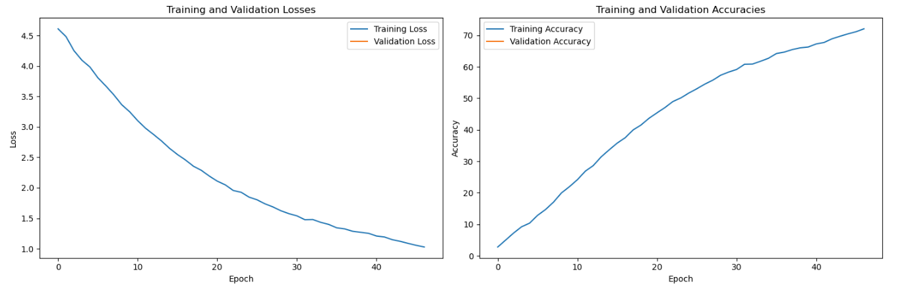
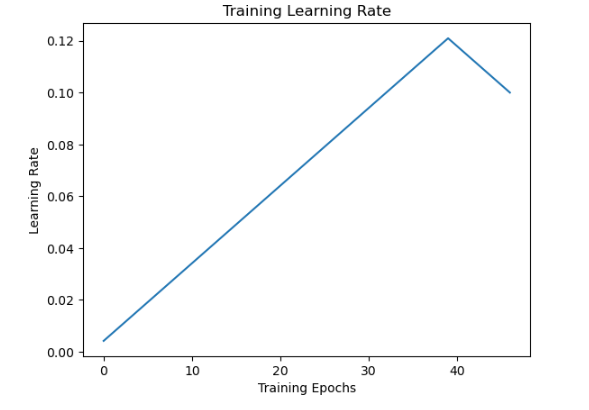
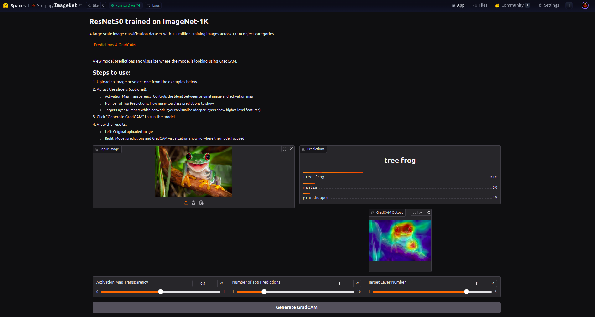

# ResNet50 on ImageNet-1K

 The target for this project is to achieve 70% accuracy on ImageNet dataset

[toc]

## About the Dataset

The **ImageNet 1K dataset**, also known as ImageNet Large Scale Visual Recognition Challenge (ILSVRC) dataset, is a widely used benchmark for image classification and other computer vision tasks. Here's a detailed overview:

### **1. Overview**

- **Size**: ImageNet 1K contains approximately 1.2 million training images, 50,000 validation images, and 100,000 test images.
- **Classes**: It is categorized into 1,000 classes, representing a wide variety of objects and scenes (e.g., animals, plants, vehicles, and daily objects).
- **Challenge**: ImageNet 1K serves as the dataset for the ILSVRC competition, which pushed advancements in deep learning and computer vision.


### **2. Structure**

The dataset is structured into three main splits:

- **Training Set**: Around 1.2 million labeled images, with ~1,300 images per class.
- **Validation Set**: 50,000 images (50 per class).
- **Test Set**: 100,000 images (not publicly labeled; used in competition settings).


### **3. Annotation**

- **Labeling**: Images are manually annotated to ensure high quality. Each image is assigned a single label corresponding to its class.
- **Source**: Images are collected from the internet and verified by human annotators using Amazon Mechanical Turk.


### **4. Applications**

The ImageNet 1K dataset is a cornerstone in computer vision research, used to:

- Train and benchmark deep learning models for image classification.
- Evaluate transfer learning methods for tasks like object detection, segmentation, and more.
- Pre-train neural networks for tasks with smaller datasets.


### **5. Impact on Deep Learning**

The ImageNet 1K dataset played a crucial role in the development of deep learning. Milestones include:

- **AlexNet (2012)**: Revolutionized deep learning by achieving top performance on ImageNet, sparking widespread adoption of convolutional neural networks (CNNs).
- **Subsequent Architectures**: Models like VGGNet, ResNet, Inception, and EfficientNet have continued to raise the bar on ImageNet benchmarks.
- **Transfer Learning**: Pre-trained models on ImageNet have been fine-tuned for various real-world tasks, making it invaluable for AI applications.


### **6. Challenges**

- **Bias**: The dataset may not fully represent real-world diversity and could include cultural or geographic biases.
- **Size**: While large, it may still lack examples for some underrepresented categories.
- **Label Noise**: Despite high-quality annotation, some mislabeled samples exist.


### **7. Accessibility**

ImageNet 1K can be downloaded after signing up and agreeing to terms of use at the [ImageNet official website](https://www.image-net.org/).


---


## Approach

- The ImageNet is a huge dataset of around 400 GBs
- Before training on such a huge dataset, a sub-set of ImageNet dataset is used to setup the workspace and check the performance of the model
- The dataset was converted to beton format using FFCV to improve training time
- Once verified, model is trained on full dataset
- LR-finder, one cycle policy and mixed precision is used to speed up the training process 


---


## Mini-ImageNet

**[Notebook on Pre-trained model](./notebooks/pytorch_model_90.ipynb)**

**[Notebook on ResNet50v2 model](custom_mini_imagenet.ipynb)**


[Dataset Link](https://www.kaggle.com/datasets/arjunashok33/miniimagenet)

This dataset is around 15 GBs and it consists of 100 classes from the original 1000 classes dataset. Following are the steps followed for training:


### 1. **Dataset Conversion**

Dataset is convert using FFCV library. **FFCV** is a library designed to accelerate deep learning workloads by optimizing data loading and preprocessing pipelines. The core idea is to speed up model training by reducing the time spent on I/O and data transformation, which are often bottlenecks in modern machine learning workflows.

```bash
# FFCV Installation
pip install setuptools==65.5.1
pip install ffcv[cuda]
pip install ffcv
```


#### **Key Features of FFCV**

1. **Custom Binary File Format**:
   - Converts datasets into a highly optimized, binary format called **Beton**, which is designed for fast access and minimal overhead.
2. **High Performance**:
   - Uses multithreading and efficient memory management to handle data loading, transformations, and transfers to the GPU.
3. **Integration**:
   - Works seamlessly with PyTorch and other popular deep learning frameworks.
   - Supports common datasets like CIFAR, ImageNet, and custom datasets.
4. **Transforms at Loading Time**:
   - Allows users to define data augmentation and transformations that are applied directly during loading, avoiding unnecessary intermediate copies.
5. **Benefits**:
   - Significant speedup in data loading compared to traditional libraries like PyTorch’s `DataLoader`.
   - Reduces CPU-GPU synchronization delays.
   - Handles large datasets efficiently.

```bash
# For training data
$ python utils/to_beton.py \
    --data-dir /data/train \
    --write-path /data/train.beton \
    --max-resolution 256 \
    --num-workers 8

# For validation data
$ python utils/to_beton.py \
    --data-dir /data/val \
    --write-path /data/val.beton \
    --max-resolution 256 \
    --num-workers 8
```


### 2. LR-finder

The **Learning Rate Finder** (**LR Finder**) is a technique used to determine the optimal learning rate for training deep learning models. It helps identify the learning rate range that results in the most effective model training. This method was popularized by Leslie N. Smith in his paper *"Cyclical Learning Rates for Training Neural Networks"* (2017).


#### **How It Works**

1. **Incremental Learning Rate**:
   - The learning rate starts from a very small value and is incrementally increased (usually exponentially) over a few iterations or epochs.
2. **Monitor Loss**:
   - During this process, the loss is tracked to observe how it changes with the increasing learning rate.
3. **Identify Optimal Range**:
   - The learning rate range is chosen based on the point where the loss starts decreasing steeply and before it begins to increase or diverge.


#### **Steps to Use LR Finder**

1. **Initialize Model**:
   - Set up your neural network model and define a loss function.
2. **Prepare LR Finder**:
   - Implement or use a library (e.g., PyTorch's `torch_lr_finder` or Keras's LR Finder extensions) to iterate through different learning rates.
3. **Run the LR Finder**:
   - Train the model over a small subset of data with varying learning rates and record the loss values.
4. **Analyze Results**:
   - Plot the learning rate vs. loss curve and choose a learning rate where the loss starts to decrease significantly.
5. **Set Learning Rate**:
   - Use the identified learning rate or range for full training.


#### **Advantages**

- **Efficient**: Helps tune the learning rate without requiring extensive hyperparameter searches.
- **Improves Convergence**: Choosing the right learning rate can speed up training and improve convergence.
- **Model-Agnostic**: Works with most deep learning models and frameworks.


#### **Example in PyTorch**

Using the `torch_lr_finder` library:

```python
pythonCopy codefrom torch_lr_finder import LRFinder

# Assume model, optimizer, and criterion are already defined
lr_finder = LRFinder(model, optimizer, criterion, device="cuda")

# Run LR Finder
lr_finder.range_test(train_loader, end_lr=10, num_iter=100)

# Plot the learning rate vs. loss curve
lr_finder.plot()

# Reset the model and optimizer states
lr_finder.reset()
```


#### **Key Points in the Loss Curve**

1. **Stable Region**: The part of the curve where the loss starts to decrease consistently.
2. **Sharp Drop**: Indicates where the learning rate is optimal for faster convergence.
3. **Divergence**: The point where the learning rate is too high, causing the loss to increase sharply.


### 3. One Cycle Policy

The **One Cycle Policy** is a training strategy for deep learning models that adjusts the learning rate and, optionally, the momentum during training. It was introduced by Leslie N. Smith in the paper *"Super-Convergence: Very Fast Training of Neural Networks Using Large Learning Rates"* (2018). This method is designed to achieve faster convergence and often better performance compared to traditional learning rate schedules.

#### **Key Principles**

1. **Learning Rate Schedule**:
   - The learning rate starts at a small value and gradually increases to a maximum (warm-up phase).
   - After reaching the maximum, the learning rate decreases back to a very low value (annealing phase).
2. **Momentum Schedule (Optional)**:
   - Momentum is inversely adjusted, decreasing as the learning rate increases and increasing as the learning rate decreases. This keeps the optimization process stable.
3. **Single Cycle**:
   - The entire learning rate schedule is completed in **one cycle**, typically spanning the full training process.


#### **Advantages**

1. #### **Faster Convergence**:

   - Helps models converge quickly by exploring a range of learning rates.

2. **Improved Generalization**:

   - The gradual decrease in learning rate toward the end helps the model settle into a minimum in the loss landscape.

3. **Simple to Use**:

   - No need for extensive tuning of learning rate schedules; the cycle adapts to the dataset and model.

4. **Works with Any Optimizer**:

   - Can be implemented with optimizers like SGD, Adam, or others.


### 4. Model Training

- Model is trained and 70% accuracy is achieved in 42 epochs



- Following is the graph showing implementation of one cycle policy



The same setup is used for larger dataset to train the model


---


## ImageNet

### 1. Download and Extract Dataset

- Model is trained on EC2 `g4dn.8xlarge` instance with the same setup
- The larger dataset dowloaded and extracted
- Size of extracted dataset is around 400 GBs


### 2. Dataset Conversion

- Data is converted using FFCV to beton format


### 3. Model Training

- LR-finder is used to find the starting learning rate
- One cycle policy is used to train the model
- Training logs are attached below


---


## Gradio App

- The trained model is deployed on Gradio

- Application Link - https://huggingface.co/spaces/Shilpaj/ImageNet

- To pull the application code

  ```bash
  ## Initialize Submodules
  $ git submodule update --init --recursive
  
  ## Pull app code
  $ git clone --recurse-submodules https://huggingface.co/spaces/Shilpaj/ImageNet
  ```

  

